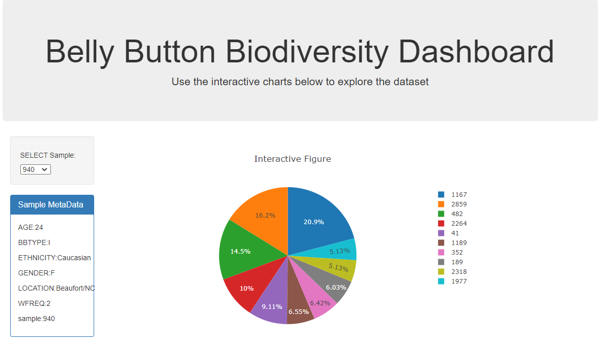

# Plot.ly Challenge - Belly Button Biodiversity

In this assignment, you will build an interactive dashboard to explore 
the [Belly Button Biodiversity DataSet](http://robdunnlab.com/projects/
belly-button-biodiversity/).

## Step 1 - Plotly.js

Interactive charts will be build by using Plotly.js for your the dashboard.

* PIE chart that uses data from your samples route 
(`/samples/<sample>`) to display the top 10 samples.

  * `sample_values` as the values for the PIE chart.

  * `otu_ids` as the labels for the pie chart.

  * `otu_labels` as the hovertext for the chart.

  

* Create a Bubble Chart that uses data from your samples route 
(`/samples/<sample>`) to display each sample.

  * Use `otu_ids` for the x values.

  * Use `sample_values` for the y values.

  * Use `sample_values` for the marker size.

  * Use `sample_values` for the marker colors.

  * Use `otu_labels` for the text values.

  

* Display the sample metadata from the route `/metadata/<sample>`

  * Display each key/value pair from the metadata JSON object 
somewhere on the page.

* Update all of the plots any time that a new sample is selected.

## Step 2 - Heroku

Deploy your Flask app to Heroku.

* You can use the provided sqlite file for the database.

## Flask API

Use Flask API starter code to serve the data needed for your 
plots.

* Test your routes by visiting each one in the browser.
